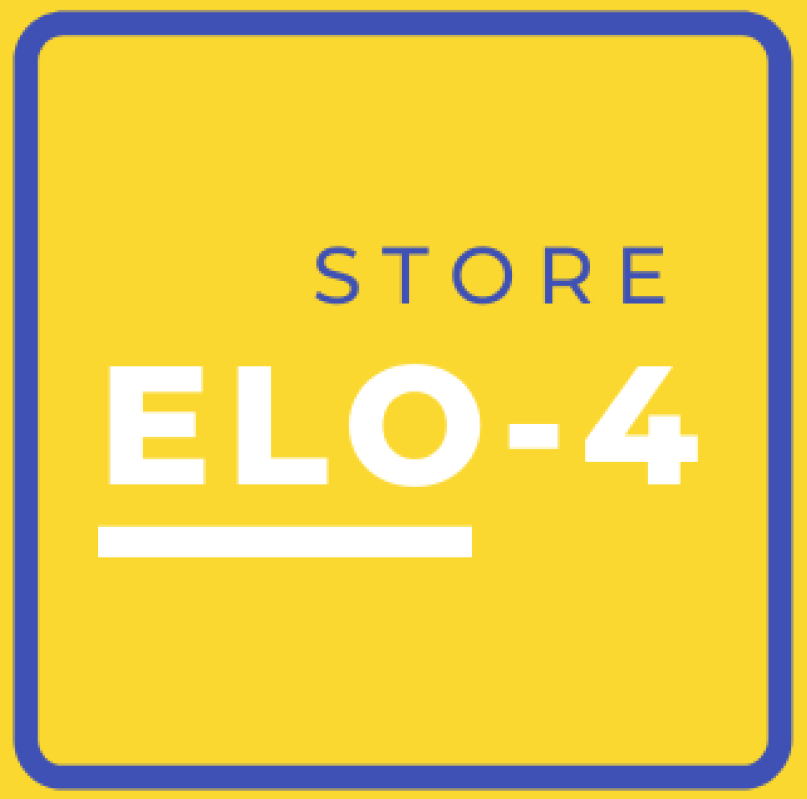
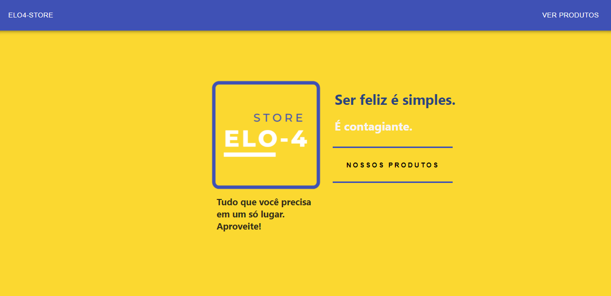
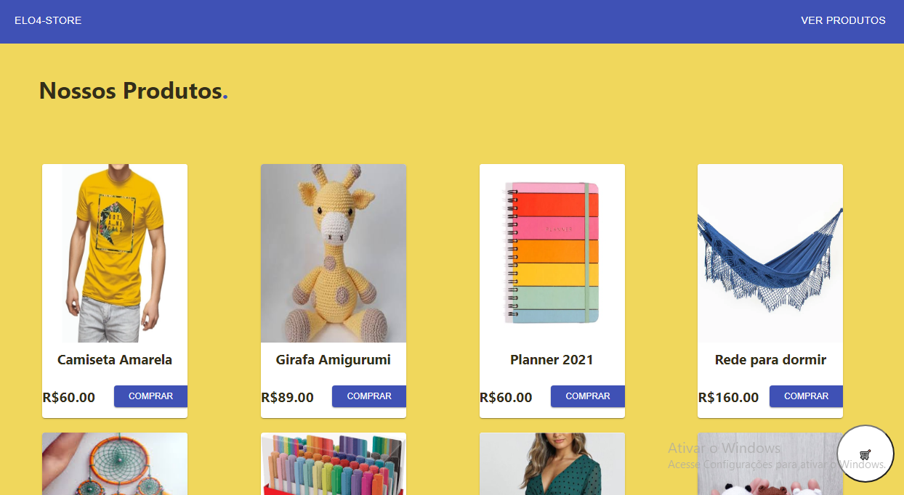
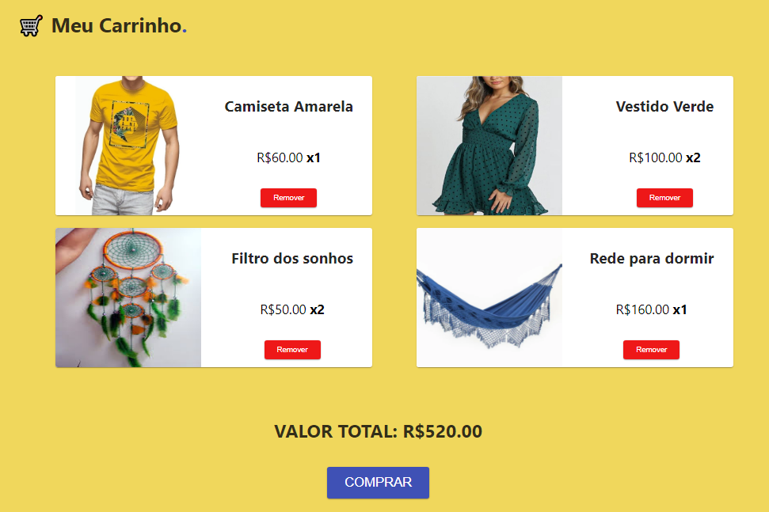

<h1 align="">
     Elo-4 Store
</h1>

<h1 align="center">
    
</h1>

<h3 align="center"> 
Ser feliz é simples. É contagiante.  
</h4>
<h4 align="center">
 Tudo que você precisa em um só lugar. Aproveite!
 </h4>

---

## :book:  Sobre    

A mini-loja fictícia <b>Elo-4 Store</b>, refere-se a um site para vendas dos mais diversos produtos, destinados à todos os gostos e públicos. 

Na Elo-4 Store, você encontra variedade em roupas mordernas, artigos de decoração para casa, pelúcias personalizadas e até material escolar. Tudo em um só lugar, com os melhores preços!

---

##  🧭Status do Projeto

 :white_check_mark: Concluído.

---

##  🎯Objetivo do Projeto

Este é um projeto Front-end, desenvolvido através do <b>Consumo da 'API Elo4'</b> no bootcamp da Labenu, cujos os principais objetivos foram o aprofundamento de fundamentamentos importantes para o desenvolvimento web Front-end, tais como: <b>Consumo de API; Async & Await; useState/useEffect; Hooks/Custom Hooks e React Router.</b>

---

## ☑️Requisitos de Funcionalidade

- :white_check_mark: Página Inicial de navegação.
- :white_check_mark: Página de Produtos + botão comprar.
- :white_check_mark: Botão Comprar funcional.
- :white_check_mark: Página do Carrinho.
- :white_check_mark: Botão Remover produto funcional.
- :white_check_mark: Calculadora do preço total da compra.

---
## :rocket:Tecnologias e Ferramentas utilizadas

- <b>React-JS</b>
- <b>Consumo de API</b>
- <b>Async & Await</b>
- <b>useState/useEffect</b>
- <b>React Router</b>
- <b>Hooks/Custom Hooks</b>
- <b>Styled-components</b>
- <b>Library Material - UI</b>

---

## 💻Demonstração

<h1 align="center">
    
  
  
</h1>

  <h1>
    :iphone: <b>Mobile</b>
  </h1>
  <h1 align="center">
    
  </h1>
  

---

## 🔗Link para Acessar

- **Link do Surge:** https://projeto-elo4store.surge.sh/

---

<!-- 
## 🛰Rodando o Projeto

~~EXPLICAR AQUI O PASSO A PASSO PARA CONSEGUIR RODAR E ACESSAR O PROJETO.~~

Para Rodar o projeto, siga as seguintes etapas :

- COLOCAR A ETAPA 1
- COLOCAR A ETAPA 2
- COLOCAR A ETAPA 3
 -->

---

## 📝Sobre a Licença

Este projeto esta sobe a licença [MIT](./LICENSE).
